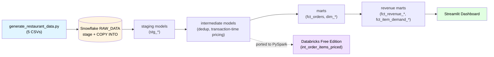

## Summary

## Architecture
This was created to model the fluctuations in restaurant revenue in relation to price increases of certain menu items. I chose restaurant orders since I plan to import real POS Clover data from my parents' restaurant. The stack is: Python generator -> Snowflake (raw_data + analytics) -> dbt_core(dbt_youngli) -> PySpark/Databricks -> Git. The source data consists of 4 restaurants, 5000 orders, and 13000 line items. I intentionally injected some messiness and included the snapshot price so that I could address the transaction-time problem.

Snowflake Databases Structure: 
    1. ANALYTICS (db)
        a. DBT_YOUNGLI (schema)
            Tables
                i. DIM_CUSTOMERS
                ii. DIM_MENU_ITEMS
                iii. DIM_RESTAURANTS
                iv. FCT_ITEM_DEMAND_BY_HOUR
                v. FCT_ORDERS
                vi. FCT_REVENUE_BY_RESTAURANT_CATEGORY_MONTH
            Views
                i. INT_ORDERS_DEDUPED
                ii. STG_CUSTOMERS
                iii. STG_MENU_ITEMS
                iv. STG_ORDERS
                v. STG_RESTAURANTS
    2. RAW_DATA (db)
        b. RESTAURANT (schema)
            Tables
                i. CUSTOMERS
                ii. MENU_ITEMS
                iii. ORDERS
                iv. ORDER_ITEMS
                v. RESTAURANTS

## Database design
Two separate databases for two separate purposes: raw_analytics houses the raw data, dbt_youngli contains all the derived tables. raw_analytics requires tighter access and can't be recovered easily if data gets lost while the dbt_youngli tables can be recomputed. The dbt layers for staging, intermediates, and marts share the same lifecycle: rebuildable from raw on demand and all owned by the same transformation logic.

## Data flow narrative
1. Generated initial dataset with generate_restaurant_data.py which contains 3 dims - restaurants, menu_items, and customers and 2 facts - orders (order grain) and order_items (line-item grain).

2. The generated csvs land in Snowflake via stage + COPY INTO. 

3. Define sources in _sources.yml, and then build the staging models with light cleanup only (stg_customers, stg_menu_items, stg_order_items, stg_orders, stg_restaurants).

4. Defined staging tests - unique/non-null on every key _stg_models.yml

5. Created intermediate models:
    a. int_orders_deduped removes duplicates using windowing and row number: ROW_NUMBER() PARTITION BY order_id ORDER BY timestamp. Selecting row number 1 doesn't make a meaningful difference because the data generated contains byte identical rows. We just deterministically pick the first one that shows up per unique order.
    b. int_order_items_priced captures the transaction-time price of the ordered item. Since menu_items.base_price doesn't account for the price fluctuations of the order item, we need to use order_items.unit_price which is the snapshot price. 

6. Marts 
    a. fct_orders: From int_order_items_priced, aggregate line items per order to generate order grain
    b. dim_customers: columns describing customer specific details like name, email, and phone number. We create a new flag here "is_signup_after_first_order" to signal when a customer has a first order timestamp before their signup date.
    dim_restaurants and dim_menu_items are pulled from staging tables without extra computations.

7. Revenue Marts
    Distribution of orders by status is 94% "completed", 4% "cancelled", and 2% "refunded". 

    a. fct_revenue_by_restaurant_category_month: We know gross revenue = sum(all transactions) and net revenue = gross - refunds - discounts/comps -> in our case this is just net = gross - refunds. Once we perform an inner join on int_order_items_priced and int_orders_deduped and dim_menu_items we have line-item grain which we can aggregate once to derive the gross revenue/total refunded order amounts on a  restaurant, category, month grain. Following from the earlier formula, net revenue is just the difference between those two.
    
    To test the claim, added tests/gross_equals_net_plus_refunded.sql that selects all rows in fct_revenue_by_restaurant_category_month where the net revenue isn't equal to the refunded amount + gross revenue.

    b. fct_item_demand_by_hour: this is the same inner join but we're instead looking at menu items and the amount they sold per order in relation to the hour of the timestamp.

    c. fct_price_ratio_by_tier: extends fct_item_demand_by_hour pre/post price bump split and applying it to the loyalty tier grain. Joins int_order_items_priced, int_orders_deduped, and dim_customers, aggregates units/revenue by tier and period, then derives the unit_ratio and revenue_ratio per tier.
8. StreamLit Dashboard
Visualize the tables from the previous part - dish demand by hour and revenue marts

Command to run in venv: streamlit run dashboard/app.py

Tab 1: Revenue by Restaurant / Category / Month
This is created by fct_revenue_by_restaurant_category_month with a join with dim_restaurants to get the restaurant names. 

Two available filters: restaurant name and category 

Based on selection of previous filters, we group by/aggregate the revenue (gross, net, refunded) per month. Displayed as a bar chart.

Tab 2: Revenue by hour of day
This is created from fct_item_demand_by_hour and reads units sold vs hour of day with a filter for category. From the data generation script we already know the distribution should have two spikes each day at 12 pm (lunch) and 7 pm (dinner):

HOUR_WEIGHTS = {11: 6, 12: 12, 13: 11, 14: 6, 15: 3, 16: 4,
                17: 8, 18: 13, 19: 14, 20: 11, 21: 7, 22: 4}

Tab 3: Price-pass through
Here we're trying to visualize the effect of the price increase on July 1, 20224. 

Starting with int_order_items_priced joined to int_orders_deduped to get the item-level grain with which we categorize the period they belong - prior to the price increase (pre) or on/after the increase (post).

Next we take the item-period grain and aggregate the revenue, units sold, and avg_realized price - the dividend of the revenue and units sold.

Finally taking a self join of the previous table gives us both the 'pre' and 'post' revenue, quantity sold, and avg_realized price on the item-level grain. The price_ratio and units_ratio is a simple division of the 'post' values by the 'pre' values.

Avg, min, max of the pre-computed price ratios are charted. 

Price ratio should agree with the price increase of around ~1.08 which we see is the case for all items as expected.

Honest Caveat: The units ratio is dependent on the predetermined distribution on which the data was generated. In practice I'd expect the price ratio to have some effect on the units ratio.

*OPTIONAL*
9. Ported the line-item revenue transform to validate the pipeline from outside the warehouse.
[`pyspark/revenue_reconciliation.ipynb`](./pyspark/revenue_reconciliation.ipynb) - reimplements transaction-time pricing logic and reconciles the output against the dbt/Snowflake result.

## When Spark, when warehouse

This project's volume (5K orders) never needed Spark — Snowflake/dbt handled every real transformation here, and that's the honest default up to hundreds of millions of rows, where warehouse SQL gives you testing, lineage, and version control nearly for free. Phase 5's PySpark port of the line-item pricing logic was a deliberate skills exercise, not a data-driven necessity — Spark earns its complexity past single-warehouse scale, or when the transform needs distributed logic SQL can't express cleanly.

## Design Decisions
 ### Tables vs Views
  We decided to treat the staging and intermediate tables as views while keeping the dimensions and facts as tables based on how expensive the underlying query is to recompute, and how often it gets recomputed. Taking a look at the 

 ### Transaction time pricing
  We could've used menu_items.base_price when calculating revenue but consider the price spike we observed in July of 8%. If base_price was snapshot post July, when we retroactively apply that price to all orders before July, the revenue would be inflated. Similarly, if the snapshot price was before July, we would silently undershoooting the revenue. This is why having and using the transaction time pricing was crucial to the revenue analysis. Another applicable scenario would be any discounted items in the order since the price difference wouldn't be reflected in the base_price.

  ### Cleaning/deduping
  Deduping runs before joining to line-item order, post join the revenue would be double counted for every duplicate row. We choose one of the duplicates to keep, since they're byte identical the one we pick isn't important -> ROW_NUMBER() PARTITION BY order_id ORDER BY order_timestamp
 
  Note: Ordering by the timestamp here doesn't matter nor does it guaranteed take the first entry since they're byte identical, we use it to just deterministically pick one.

  Honest Caveats: "This dedup logic assumes byte identical duplicates which won't always be the case in production scenario - e.g. retried submissions or sync conflicts. In those cases we would need to consider similar entries with slightly differing fields (duplicate landing across a price change boundary). It's not currently addresed in this implementation.

  ### Messiness handling
    Proactively applied normalization (nullif(trim())) to the string columns that're used in filtering/could potentially cause failures with malformeed strings, not all columns.

    a. stg_customers: phone number and email can be missing or have trailing/leading whitespace -> nullif(trim(phone), '') or nullif(trim(email), ''). We don't need to handle missing values here since we're not using them for analysis.

    b. stg_menu_items: base_price::numeric(10,2) makes sure base_price is a valid dollar amount (max ten digits to left of decimal and two to the right)

    c. stg_order_items: unit_price::numeric(10, 2) same reasoning as b

    d. stg_orders: lower(trim(order_type)) and lower(trim(payment_method)) normalizes order_type and payment_type by assigning all lower case and removing trailing or leading whitespaces. 

    Payment method canonical values are card / cash / mobile_pay / gift_card but we see values like 'giftcard' and 'mobile pay' so we need to use a conditional expression match such cases and normalize.
    
    e. stg_restaurants: Cast opened_date as a date type.  

    Notice not all columns are treated to normalization, from the target featureset, we targeted those that would create new buckets or fail the model otherwise. 
 ### Revenue Grain
    Two approaches to pick from here - the easy path would be to select all orders with status = 'completed' and use that subgroup to pull the revenue. However, I rejected this method because cancelled and refunded orders are still legitimate business signals. Cancelled orders technically don't represent a real transaction so they're excluded entirely upstream of the join. We can map the relationship between the remaining revenue values: net revenue = gross revenue - refunded amount.

### Absence of order_total in raw
    The generator omits order_total, so revenue is derived bottom-up from order_items.unit_price. A stored total, if present, would be transaction-time-safe by construction — computed once, at order time, never recalculated. A derived total is only as safe as the snapshotting discipline behind it: aggregating from unit_price preserves that safety, but the risk is real if a derivation mistakenly joins to menu_items.base_price instead, which is exactly the bug the transaction-time-pricing design decision is meant to prevent. In a system with both, agreement between the stored and derived totals would be a meaningful data-quality signal — and disagreement would point first at whether the derivation is joining to the right price column.

    The generator omits order_total, so revenue is derived bottom-up from order_items.unit_price. A stored total, if present, would be transaction-time-safe by construction — computed once, at order time, never recalculated. A derived total is only as safe as the snapshotting discipline behind it: aggregating from unit_price preserves that safety, but the risk is real if a derivation mistakenly joins to menu_items.base_price instead, which is exactly the bug the transaction-time-pricing design decision is meant to prevent. In a system with both, agreement between the stored and derived totals would be a meaningful data-quality signal — and disagreement would point first at whether the derivation is joining to the right price column."

### Signup after orders
The generator intentionally assigns an order_date >= signup_date for a few customers i.e. not all customers who ordered something was in the loyalty program. Our inital approach was to raise a warning when we encountered such a case. But this is incorrect because it's not a signal about the data correctness, we'd be raising flags on viable scenarios.  

Knowing the population that did sign up after their first order is genuinely useful business insights so we created analyses/signup_after_first_order_rate.sql. It calculates the percentage of customers of the total consumer base that signed up after their first order.

