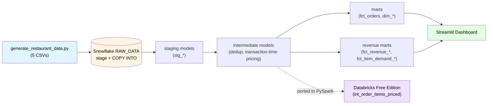
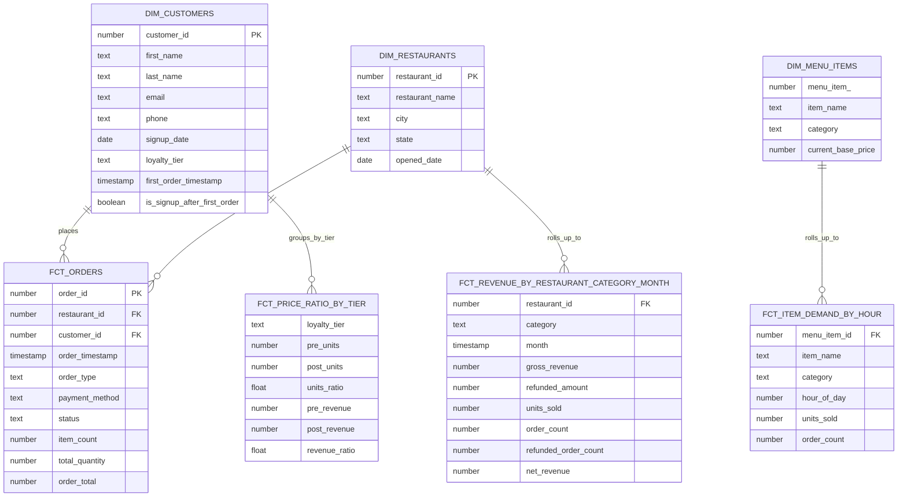
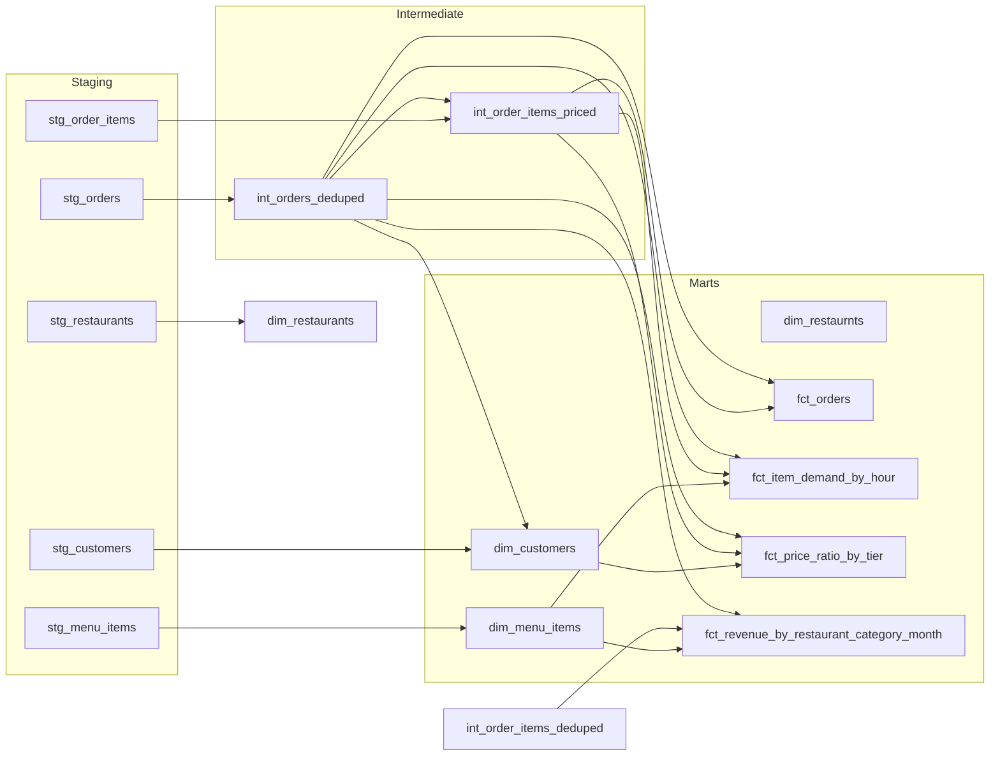

# Restaurant Analytics Pipeline

## Overview

A dbt + Snowflake + PySpark pipeline built on synthetic restaurant POS data, modeling transaction-time pricing, dedup, and staging cleanup the way a real operational system would.

Built to demonstrate production-grade pipeline design outside a vendor/staffing environment.

## Architecture


```mermaid
flowchart LR
    A["generate_restaurant_data.py<br/>(5 CSVs)"] --> B[("Snowflake RAW_DATA<br/>stage + COPY INTO")]
    B --> C["staging models<br/>(stg_*)"]
    C --> D["intermediate models<br/>(dedup, transaction-time pricing)"]
    D --> E["marts<br/>(fct_orders, dim_*)"]
    D --> F["revenue marts<br/>(fct_revenue_*, fct_item_demand_*)"]
    E --> G["Streamlit Dashboard"]
    F --> G
    D -.->|ported to PySpark| H["Databricks Free Edition<br/>(int_order_items_priced)"]

    style A fill:#e1f5ff,color:#000
    style B fill:#fff4e1,color:#000
    style H fill:#f0e1ff,color:#000
    style G fill:#e1ffe1,color:#000
```

**Stack flow**
1. Python generator → Snowflake `RAW_DATA` (stage + COPY INTO)

2. dbt: staging views → intermediate views → marts tables (Snowflake `ANALYTICS`)

3. Streamlit dashboard consumes the intermediates and marts.

    **Parallel:** PySpark/Databricks reimplements the line-item pricing transform independently, reconciled against the dbt/SQL output.

## Repository Structure

```
restaurant_analytics/
├── models/
│   ├── staging/                      # 1:1 with raw sources, light cleanup, views
│   │   └── _sources.md               # raw source contract: grain, PK, messiness
│   ├── intermediate/                 # dedup, transaction-time pricing, views
│   └── marts/                        # fact/dim tables, dashboard-facing
├── macros/
│   └── generate_alias_name.sql       # vw_ prefix for view-materialized models
│   └── generate_schema_name.sql      # maps models to staging/intermediate/marts schemas
├── analyses/                         # ad-hoc queries, not part of the DAG
│   └── signup_after_first_order.sql
├── notebooks/
│   └── int_order_items_priced.ipynb  # PySpark port, Databricks Free Edition
├── tests/                            # custom singular tests
├── sql/                              # raw stage + COPY INTO scripts (pre-dbt)
├── dashboard/
│   └── app.py                        # Streamlit app
├── generate_restaurant_data.py       # synthetic source data generator
├── dbt_project.yml
├── packages.yml
├── requirements.txt
├── sample.profiles.yml               # dbt connection template 
├── sample.secrets.toml               # Streamlit connection template
└── README.md
```

## Getting Started

### Prerequisites

- Python 3.10+ 
- A snowflake account with a warehouse, and a role with create/select privileges on two databases (`RAW_DATA`, `ANALYTICS`)
- dbt Core (dbt-snowflake adapter)
- Databricks account (Free edition works) - only needed for PySpark layer

### Setup

1. Clone the repo and create a virtual environment:  
    ```bash
    git clone https://github.com/YoungliHong/restaurant_analytics
    cd restaurant_analytics
    python -m venv venv
    source venv/bin/activate
    ```

2. Install Python dependencies:
    ```bash
    pip install -r requirements.txt
    ```

3. Generate a key pair for Snowflake authentication:
    ```bash
    openssl genrsa -out snowflake_key.p8 2048
    openssl rsa -in snowfllake_key.p8 -pubout -out snowflake_key.pub
    ```
    Register the public key on your Snowflake user. 
    (`ALTER USER <user> SET RSA_PUBLIC_KEY = <'contents of .pub file'>;`)

3. Configure your dbt Snowflake connection in `~/.dbt/profiles.yml` (see `sample.profiles.yml` for expected structure)

4. Generate synthetic source data:
    ```bash
    python generate_restaurant_data.py
    ```

5. Load raw CSVs into Snowflake (stage + COPY INTO  - see `sql/load_raw.sql`)

6. Run dbt:
    ```bash
    dbt run
    dbt test
    ```

7. Configure Streamlit's Snowflake connection in `.streamlit/secrets.toml` (see `sample.secrets.toml`)

## Data Model

### Raw Sources

 Five CSV's land in `RAW_DATA`, similar to what would be seen in a POS extract: two small reference tables (`restaurants` and `menu_items`), a growing customer dimension (`customers`), and two fact tables (`orders` and `order_items`).  The full grain, primary keys, and known source messiness is documented in `models/staging/_sources.md`. 

### Entity Relationship Diagram


```mermaid
erDiagram
  DIM_CUSTOMERS ||--o{ FCT_ORDERS : places
  DIM_RESTAURANTS ||--o{ FCT_ORDERS : hosts
  DIM_RESTAURANTS ||--o{ FCT_REVENUE_BY_RESTAURANT_CATEGORY_MONTH : rolls_up_to
  DIM_MENU_ITEMS ||--o{ FCT_ITEM_DEMAND_BY_HOUR : rolls_up_to
  DIM_CUSTOMERS ||--o{ FCT_PRICE_RATIO_BY_TIER : groups_by_tier

  DIM_CUSTOMERS {
    number customer_id PK  
    text first_name
    text last_name
    text email
    text phone
    date signup_date
    text loyalty_tier
    timestamp first_order_timestamp
    boolean is_signup_after_first_order
  }
  DIM_MENU_ITEMS {
    number menu_item_
    text item_name
    text category
    number current_base_price
  }
  DIM_RESTAURANTS {
    number restaurant_id PK
    text restaurant_name
    text city
    text state
    date opened_date
  }
  FCT_ORDERS {
    number order_id PK
    number restaurant_id FK
    number customer_id FK
    timestamp order_timestamp
    text order_type
    text payment_method
    text status
    number item_count
    number total_quantity
    number order_total
  }
  FCT_ITEM_DEMAND_BY_HOUR {
    number menu_item_id FK
    text item_name
    text category
    number hour_of_day
    number units_sold
    number order_count
  }
  FCT_REVENUE_BY_RESTAURANT_CATEGORY_MONTH {
    number restaurant_id FK
    text category
    timestamp month
    number gross_revenue
    number refunded_amount
    number units_sold
    number order_count
    number refunded_order_count
    number net_revenue
  }
  FCT_PRICE_RATIO_BY_TIER {
    text loyalty_tier
    number pre_units
    number post_units
    float units_ratio
    number pre_revenue
    number post_revenue
    float revenue_ratio
  }
```
### Staging → Intermediate → Marts 

**Staging** - one model per source, same grain as the source table (1:1, no joins or aggregation). Light cleanup only: casing/whitespace normalization, null coercion. Materialized as views. Only the intermediates will consume these views directly. 

**Intermediates** - logic that changes cardinality or is shared by multiple downstream models: order deduplication (many-to-one -> one-to-one per order_id), transaction-time price application.  Materialized as views (queried directly by marts and dashboard - see Design Decisions). 

**Marts** - final, business-facing models. Fact tables (`fct_orders`, `fct_revenue_by_restaurant_category_month`, etc.) at event/measurement grain, dimension tables (`dim_customers`, `dim_restaurants`, `dim_menu_items`) with descriptive attributes, joined star-schema style. Materialized as tables, queried by the dashboard. 

## Lineage Graph


```mermaid
graph LR
    subgraph Staging
        stg_orders
        stg_order_items
        stg_customers
        stg_menu_items
        stg_restaurants
    end

    subgraph Intermediate
        int_orders_deduped
        int_order_items_priced
    end

    subgraph Marts
        dim_customers
        dim_menu_items
        dim_restaurnts
        fct_orders
        fct_item_demand_by_hour
        fct_price_ratio_by_tier
        fct_revenue_by_restaurant_category_month
    end

    stg_orders --> int_orders_deduped
    stg_order_items --> int_order_items_priced
    int_orders_deduped --> int_order_items_priced

    int_orders_deduped --> dim_customers
    stg_customers --> dim_customers
    stg_menu_items --> dim_menu_items
    stg_restaurants --> dim_restaurants

    int_order_items_priced --> fct_orders
    int_orders_deduped --> fct_orders

    dim_menu_items --> fct_item_demand_by_hour
    int_order_items_priced --> fct_item_demand_by_hour
    int_orders_deduped --> fct_item_demand_by_hour

    dim_customers --> fct_price_ratio_by_tier
    int_order_items_priced --> fct_price_ratio_by_tier
    int_orders_deduped --> fct_price_ratio_by_tier

    dim_menu_items --> fct_revenue_by_restaurant_category_month
    int_order_items_deduped --> fct_revenue_by_restaurant_category_month
    int_orders_deduped --> fct_revenue_by_restaurant_category_month
```
*Note: Graph is rendered via Mermaid from `manifest.json`'s `parent_map`, since `dbt docs generate` isn't fully supported under the dbt Fusion engine (alpha) used here.*


## Design Decisions
### Two-database architecture (RAW_DATA vs ANALYTICS)

The decision to use two databases was made by considering blast radius and contract boundaries. Isolating the source tables in a separate database means we can easily rebuild our model without regenerating the source data, while simultaneously supporting the principle of least privilege. 
    
### Views vs. tables by layer (and why intermediate deviates from ephemeral)

Intermediates use views rather than dbt's more common ephermeral default, because the dashboard queries both intermediate views for the price-pass through tab. Ephemeral models don't exist as queryable objects outside of dbt's own compile graph. They only exist as inlined CTEs within whatever references them.


### Transaction-time pricing (unit_price snapshot vs. base_price)

Revenue calculations use `order_items.unit_price` rather than joining to `menu_items.base_price` because the former yields the transaction time price snapshot. The base price table only holds the current state price and using that would silently overstate the historical revenue before the price increase. The third tab of the dashboard validates this, we see that the transaction time pricing accurately reflects ~1.08 average realized price ratio which is consistent with the price increase.
  
### Order deduplication (ROW_NUMBER, fan-out risk, test placement)

Deduping runs before joining to line-item order, post join the revenue would be double counted for every duplicate row. We choose one of the duplicates to keep, since they're byte identical the one we pick isn't important -> ` ROW_NUMBER() PARTITION BY order_id ORDER BY order_timestamp`
 
Note: Ordering by the timestamp here doesn't matter nor does it guaranteed take the first entry since they're byte identical, we use it to just deterministically pick one.

Honest Caveats: This dedup logic assumes byte identical duplicates which won't always be the case in production scenario - e.g. retried submissions or sync conflicts. In those cases we would need to consider similar entries with slightly differing fields (duplicate landing across a price change boundary). It's not currently addresed in this implementation.

### Signup-after-first-order handling

The generator intentionally produces some customers with a signup_date after their first order — a plausible real-world pattern (a walk-in customer joining loyalty program after their first visit), not corrupted data. An early version of this check was a dbt test asserting `signup_date <= first_order_date` In practice, `analyses/signup_after_first_order_rate.sql` shows this holds for ~21% of customers (166/800) - too high a rate to be noise, and not actually invalid. A test expected to fail on one in five rows isn't a meaninful test, so the check was moved to an analysis reporting the rate directly, and a boolean flag (`signup_after_first_order`) was added to `dim_customers` so the pattern is queryable rather than either silently ignored or treated as a pipeline failure.

### Naming convention: model name (layer) vs. alias (materialization)

Model file names reflect DAG layer (`stg_`/`int_`/`fct_`/`dim_`), while a `generate_alias_name` macro overrides add a `vw_` prefix only to the physical Snowflake object for view-materialized models. Keeping the these separate means changing the model's materialization later doesn't require renaming the file or updating any `ref()` calls - file identity and physical object identity are deliberately decoupled.

## Dashboard

### Setup

1. **Open your teminal and navigate to the project directory.**

2. **Create and activate a virtual environment.**

    - **macOS / Linux / Git Bash:** 
        ```bash
        python -m venv venv
        source venv/bin/activate
        ```

    - **Windows (Powershell):**
        ```powershell
        python -m venv venv
        .\venv\Scripts\Activate.ps1
        ```
    
    - **Windows (Command Prompt):**
        ```cmd
        python -m venv venv
        venv\Scripts\activate.bat
        ```

3. **Run the Streamlit app:**
   ```bash
   streamlit run dashboard/app.py
   ```


### Tab 1: Revenue by Restaurant / Category / Month 
This is created by fct_revenue_by_restaurant_category_month with a join with dim_restaurants to get the restaurant names. 

Two available filters: restaurant name and category 

Based on selection of previous filters, we group by/aggregate the revenue (gross, net, refunded) per month. Displayed as a bar chart.

### Tab 2: Revenue by hour of day

This is created from `fct_item_demand_by_hour` and reads units sold vs hour of day with a filter for category. The user should see two distinct spikes each day at round 12 pm (lunch) and 7 pm (dinner), a quick sanity check in the generate_restaurant_data.py script confirm this should be the case (see HOUR_WEIGHTS).

`HOUR_WEIGHTS = {11: 6, 12: 12, 13: 11, 14: 6, 15: 3, 16: 4,
                17: 8, 18: 13, 19: 14, 20: 11, 21: 7, 22: 4}`

### Tab 3: Price-pass through

Given we know the price of menu items increased on July 1, 2024, we want to determine if that increase actually showed up in realized revenue for each item or if it resulted in mix shift. 

To do so we start with `vw_int_order_items_priced`, which is on item-level grain and inner join with `vw_int_orders_deduped` to get the individual timestamp each item was ordered. Then we can use the item's order timestamp to signal which period it belongs to (pre or post). It's also important to use the order's status here to filter out items ordered under cancelled orders. 

From this order item grain dataset, we can now aggregate each item's pre vs post revenue along with the total quantity ordered. The average realized price for each item's period can be computed as the quotient of the total revenue by the total quantity ordered.

From the result of the previous aggregation, we have each menu-item's pre and post price spike average realized prices so the last step is to coalesce back into item-grain. Price ratio is computed here as $\frac{pre.avg\_realized\_price}{post.avg\_realized\_price}$. Similarly the units ratio is $\frac{pre.units\_sold}{post.units\_sold}$.

For this dataset, the price ratio agree with the price increase of around ~1.08 for all items. Answering our initial question of whether the increase would be observed in the revenue or mix shift.


## Spark / Databricks Layer

`int_orders_priced` was ported to PySpark and run on Databricks Free Edition (serverless) not out of a data driven necessity but to validate the transform in a distributed compute context and to get hands-on experience with distributed computing systems outside of Cosmos/SCOPE, Microsoft's internal big data framework. While the two share the same underlying distributed computing principles, Cosmos and SCOPE is optimized for ultra large batch workloads. The output matched the dbt/Snowflake version exactly ($180,604.30).


We can assess if the Spark has a place in the pipeline by considering two different 
- Data volume exceeds single-node or warehouse-scale efficiency (multi TB)
- Complex non-SQL-expressable transformations

Taking this project's workload into this context - the volume or orders to process are only in the thousands and transformations can be expressed as straightforward SQL queries. Thus there isn't a substantial performance benefit to using Spark in this project, but we can still understand the different approach.

## Testing

- What's tested and where (staging vs. intermediate)
- How to run `dbt test`

## Future Work
- Phase 7 (real POS data) — noted as deliberately out of scope for now


- `stg_customers`: Phone number and email can be missing or have trailing/leading whitespace -> `nullif(trim(phone), '')` or `nullif(trim(email), '')`. 

    - Note: While phone and email aren't used in the revenue marts, its inclusion in the staging model means we should proactively normalize these fields.

- `stg_menu_items` & `stg_order_items`: `unit_price` and `base_price` are examples of numerical columns that we would want normalized `column_name::numeric(10,2)` in the revenue mart.

-  `stg_orders`: The `lower(trim(order_type))` and `lower(trim(payment_method))` normalizes order_type and payment_type by assigning all lower case and removing trailing or leading whitespace te
    - `payment_method` canonical values are "card" / "cash" / mobile_pay / gift_card but we see values like 'giftcard' and 'mobile pay' so we use a conditional expression match such cases and normalize.

- `stg_restaurants`: Cast opened_date as a date type. 


## Data Flow 
1. Run `generate_restaurant_data.py` to generate the five tables: `CUSTOMERS`, `MENU_ITEMS`, `ORDERS`, `ORDER_ITEMS`, `RESTAURANTS` locally. 

2. `STAGE + COPY INTO` the raw source tables into Snowflake `RAW_DATA` db.

3. Based on source contract, the five staging models are built per source. See above section on Messiness Handling.


4. Intermediate models are created views from the staging models:
    - `vw_int_orders_deduped` 
    removes duplicates from stg_orders using windowing and row number i.e. `ROW_NUMBER() PARTITION BY order_id ORDER BY timestamp`. Byte identical duplicates implies the actual entry we choose to keep doesn't matter as long as we dedupe the others.

    - ` vw_int_order_items_priced ` captures the transaction-time price of the ordered item. This is line-item grain. Since menu_items.base_price doesn't account for the price fluctuations of the order item, we need to use order_items.unit_price which is the snapshot price. 

5. Marts are constructed from the intermediate models with the goal of being able to use the revenue marts directly in the analysis dashboard. 

    - `fct_orders` serves as the primary revenue mart, it provides an accurate order grain revenue for each restaurant to model. This is only possible by using the transaction time line-item dataset that we join and aggregate to order grain.

    - `dim_customers`: One additional flag, `is_signup_after_first_order`, created based on `first_order_timestamp < signup_date`. That is, we take each customer's first order and set the flag based on their signup status from that timestamp.

    - `dim_restaurants` and `dim_menu_items` are pulled from staging tables without extra computations.

## Revenue Marts

`fct_revenue_by_restaurant_category_month:`
We know gross revenue = sum(all transactions) and net revenue = gross - refunds - discounts/comps -> in our case this is just net = gross - refunds. Once we perform an inner join on int_order_items_priced and int_orders_deduped and dim_menu_items we have line-item grain which we can aggregate once to derive the gross revenue/total refunded order amounts on a  restaurant, category, month grain. Following from the earlier formula, net revenue is just the difference between those two.
  
`fct_item_demand_by_hour:`
This is the same inner join but we're instead looking at menu items and the amount they sold per order in relation to the hour of the timestamp.


`fct_price_ratio_by_tier:`
Extends `fct_item_demand_by_hour` pre/post price bump split and applies it to the loyalty tier grain. Then joins int_order_items_priced, int_orders_deduped, and dim_customers, aggregates units/revenue by tier and period, then derives each tier's unit_ratio and revenue_ratio


*OPTIONAL*  
Ported the line-item revenue transform to validate the pipeline from outside the warehouse.
[`notebooks/int_order_items_priced.ipynb`](./notebooks/int_order_items_priced.ipynb) - reimplements transaction-time pricing logic and reconciles the output against the dbt/Snowflake result.


## Design Decisions
 ### Tables vs Views
   Intermediates use views rather than dbt's more common ephermeral default, because the dashboard queries both intermediate views for the price-pass through tab. Ephemeral models don't exist as queryable objects outside of dbt's own compile graph. They only exist as inlined CTEs within whatever references them.

 ### Transaction time pricing
  Revenue calculations use `order_items.unit_price` rather than joining to `menu_items.base_price` because the former yields the transaction time price snapshot. The base price table only holds the current state price and using that would silently overstate the historical revenue before the price increase. The third tab of the dashboard validates this, we see that the transaction time pricing accurately reflects ~1.08 average realized price ratio which is consistent with the price increase.
  
  
  ### Cleaning/deduping
   Deduping runs before joining to line-item order, post join the revenue would be double counted for every duplicate row. We choose one of the duplicates to keep, since they're byte identical the one we pick isn't important -> ` ROW_NUMBER() PARTITION BY order_id ORDER BY order_timestamp`
 
  Note: Ordering by the timestamp here doesn't matter nor does it guaranteed take the first entry since they're byte identical, we use it to just deterministically pick one.

  Honest Caveats: "This dedup logic assumes byte identical duplicates which won't always be the case in production scenario - e.g. retried submissions or sync conflicts. In those cases we would need to consider similar entries with slightly differing fields (duplicate landing across a price change boundary). It's not currently addresed in this implementation.

 ### Revenue Grain
Two approaches to pick from here - the easy path would be to select all orders with status = 'completed' and use that subgroup to pull the revenue. However, I rejected this method because cancelled and refunded orders are still legitimate business signals. Cancelled orders technically don't represent a real transaction so they're excluded entirely upstream of the join. We relationship we can define then is `net revenue = gross revenue - refunded amount`.

### Absence of order_total in raw
The generator omits order_total, so revenue is derived bottom-up from order_items.unit_price. A stored total, if present, would be transaction-time-safe by construction — computed once, at order time, never recalculated. A derived total is only as safe as the snapshotting discipline behind it: aggregating from unit_price preserves that safety, but the risk is real if a derivation mistakenly joins to menu_items.base_price instead, which is exactly the bug the transaction-time-pricing design decision is meant to prevent. In a system with both, agreement between the stored and derived totals would be a meaningful data-quality signal — and disagreement would point first at whether the derivation is joining to the right price column.

The generator omits order_total, so revenue is derived bottom-up from order_items.unit_price. A stored total, if present, would be transaction-time-safe by construction — computed once, at order time, never recalculated. A derived total is only as safe as the snapshotting discipline behind it: aggregating from unit_price preserves that safety, but the risk is real if a derivation mistakenly joins to menu_items.base_price instead, which is exactly the bug the transaction-time-pricing design decision is meant to prevent. In a system with both, agreement between the stored and derived totals would be a meaningful data-quality signal — and disagreement would point first at whether the derivation is joining to the right price column."

### When Spark, when warehouse
This project's volume (5K orders) never needed Spark — Snowflake/dbt handled every real transformation here, and that's the honest default up to hundreds of millions of rows, where warehouse SQL gives you testing, lineage, and version control nearly for free. Phase 5's PySpark port of the line-item pricing logic was a deliberate skills exercise, not a data-driven necessity — Spark earns its complexity past single-warehouse scale, or when the transform needs distributed logic SQL can't express cleanly.

### Signup after orders
The generator intentionally produces some customers with a signup_date after their first order — a plausible real-world pattern (a walk-in customer joining loyalty program after their first visit), not corrupted data. An early version of this check was a dbt test asserting `signup_date <= first_order_date` In practice, `analyses/signup_after_first_order_rate.sql` shows this holds for ~21% of customers (166/800) - too high a rate to be noise, and not actually invalid. A test expected to fail on one in five rows isn't a meaninful test, so the check was moved to an analysis reporting the rate directly, and a boolean flag (`signup_after_first_order`) was added to `dim_customers` so the pattern is queryable rather than either silently ignored or treated as a pipeline failure.

